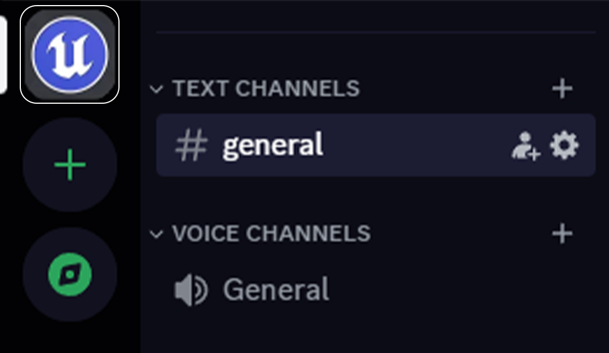
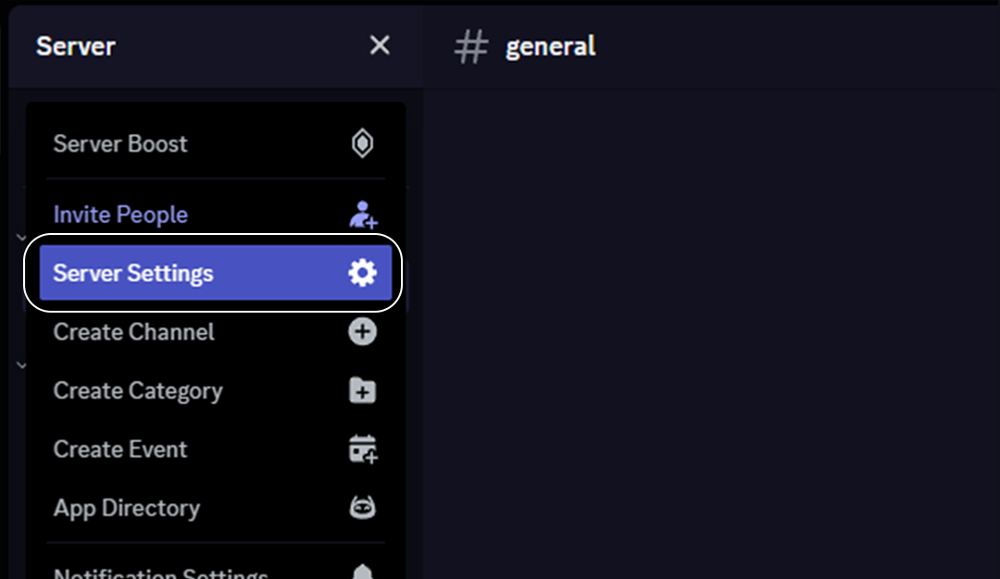
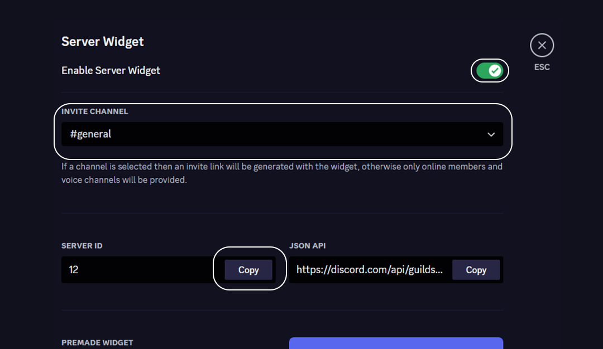
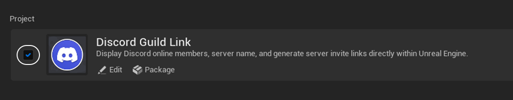
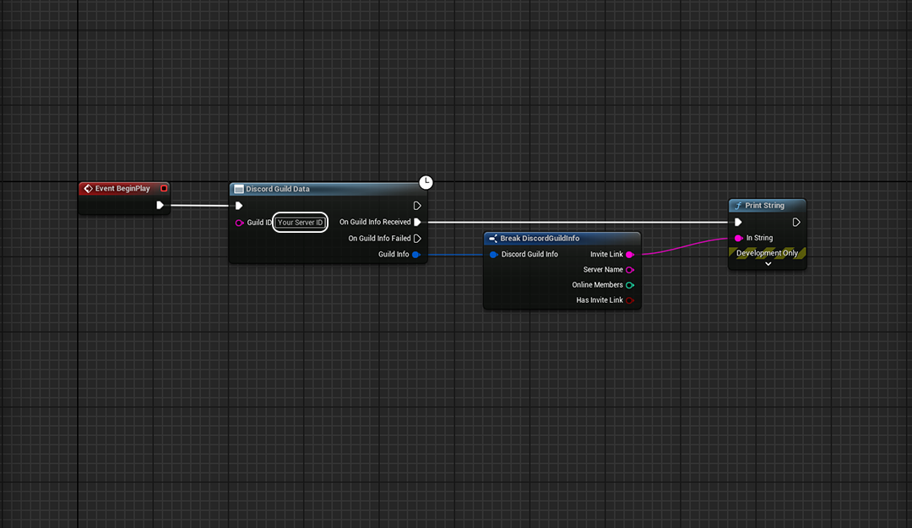

# DiscordGuildLink

This plugin seamlessly integrates your Discord server into your Unreal Engine project. Display the number of online members, server name, and generate instant invite links.

## How to Use

1. Click on your server.
   
   

2. Navigate to server settings.
   
   

3. Enable "Server Widget".
   Choose a channel under "Invite Channel" (this is required for an invite link), and copy your server ID.
   
   

4. Go to Unreal Engine > Edit > Plugins.
   Enable the DiscordGuildLink plugin.
   
   

5. In the blueprint graph:
   Call the DiscordGuildData event and paste your server ID in GuildID.
   
   

## Plugin Link

Get the plugin from the [Unreal Engine Marketplace](https://www.unrealengine.com/marketplace/en-US/product/4b0632e0dd82449ea1ddc9d7e38b10d9).

## Notes

You can find an example widget in the plugin folder "example," which includes a demo widget for quick setup.
This widget can be found in: Plugins > Discord Guild Link Content > Example > WBP_Demo.
Click on the WBP_DemoWidget element on the Hierarchy tab. In the details panel, navigate to the Discord Guild Link section and input your server ID into the guild ID field.
